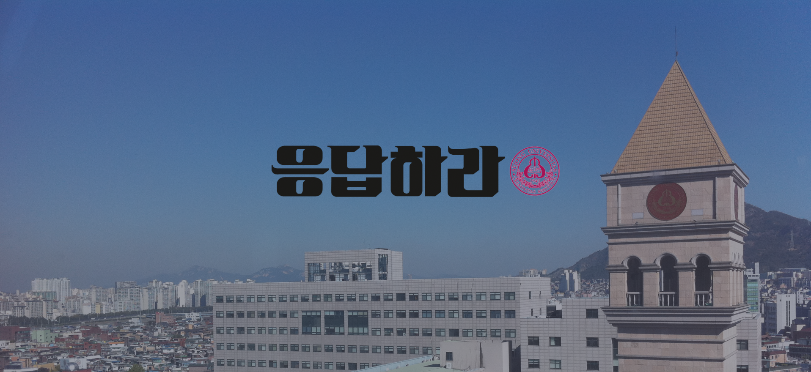
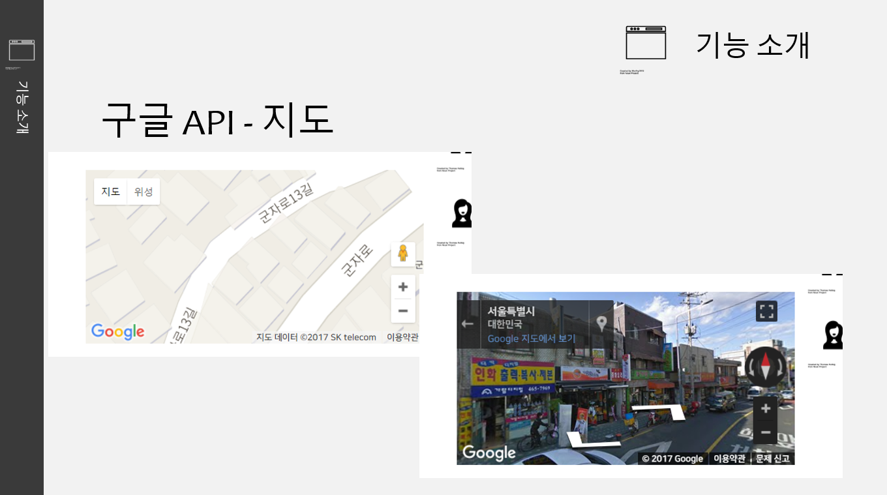

Play Around The School
===

학교 주변 놀거리 웹사이트

- 핵심 목표: HTML 문법 익숙해지기 !!
- Keyword: HTML, JavaScript, JQuery, Google Map Api, LightBox
- 개발 기간: 2017.04 ~ 2017.05

> Readme 작성중...

 

사이트맵
---
카테고리(대분류) : Food(음식), Shop(가게), Play(놀거리), Inn(숙박), Beauty(뷰티)

- 음식(소분류) : 한식, 일식, 중식, 양식, 해산물 요리, 카페
- 가게(소분류) : 종합패션, 멀티플렉스, 문구/팬시용품, 안경원, 컴퓨터
- 놀거리(소분류) : 귀금속, 오락실/멀티방, 영화관
- 숙박(소분류) : 모텔, 호텔, 게스트 하우스
- 뷰티(소분류) : 화장품, 헬스장, 마사지, 성형외과, 미용실

| 메인 페이지 |
|:----------------------------------------:|
||

| 음식 페이지 | 음식 상세 페이지 |
|:----------------------------------------:|:-----------------------------------------:|
|||

| 가게 페이지 | 가게 상세 페이지 |
|:----------------------------------------:|:-----------------------------------------:|
|||

| 놀거리 페이지 | 놀거리 상세 페이지 |
|:----------------------------------------:|:-----------------------------------------:|
|||

| 숙박 페이지 | 숙박 상세 페이지 |
|:----------------------------------------:|:-----------------------------------------:|
|||

| 뷰티 페이지 | 뷰티 상세 페이지 |
|:----------------------------------------:|:-----------------------------------------:|
|||

 

전체 웹페이지 구조도
---

 

페이지 Element 구조
---
| 목록 페이지 Elements | 상세 페이지 Elements |
|:----------------------------------------:|:-----------------------------------------:|
|||

| 재고조회 페이지 Elements | 예약 페이지 Elements |
|:----------------------------------------:|:-----------------------------------------:|
|||

 

기능 구현
---

| 검색 기능 - 이름으로 검색 | 검색 기능 - 분류별 검색 |
|:----------------------------------------:|:-----------------------------------------:|
|||

| 조회수 카운트 기능 | 마우스 hover 기능 |
|:----------------------------------------:|:-----------------------------------------:|
|||

| 구글 지도 기능  | 가격 그래프 기능 |
|:----------------------------------------:|:-----------------------------------------:|
|||

| 이미지 여러개 띄우기 | 고정바 기능 |
|:----------------------------------------:|:-----------------------------------------:|
|||

| 평점 기능 |
|:----------------------------------------:|
||

 

프로젝트에 대한 요약 설명
---
- 프론트엔드 위주로 짰습니다.
- 서버가 없습니다.

 

어떻게 실행하나요?
---

##### ※ 프로그램 실행 순서 ※ 
  
-> main-page.html

맺으며
---
- 팀원들과 웹프로그래밍을 2017년도에 처음 배웠을 때 만든거라 하드 코딩식으로 문법 익히기 위주로 짰습니다.
- HTML 문법 익히는데는 좋았습니다.
- 시간이 부족해서 백엔드쪽은 못만들었네요 ㅠㅠ
- 시간이 남는다면 디자인을 다듬고 서버를 추가해 넣고 싶네요

License
---
This is released under the MIT license. See [LICENSE](LICENSE) for details.
